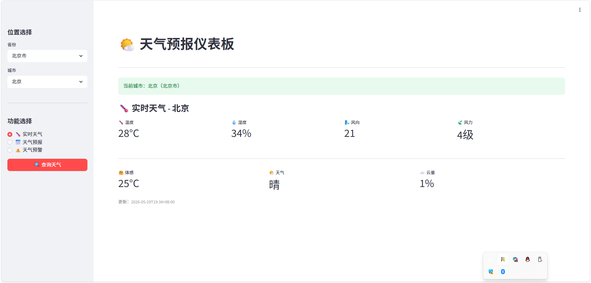
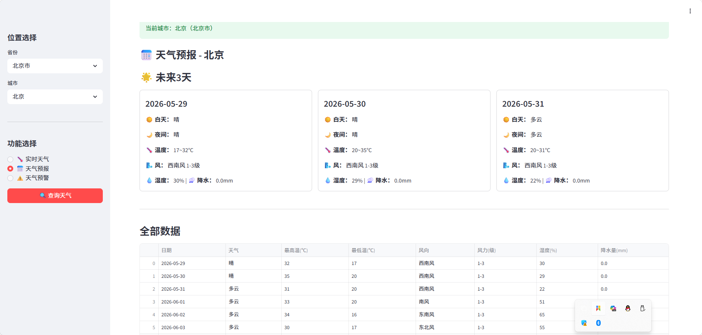
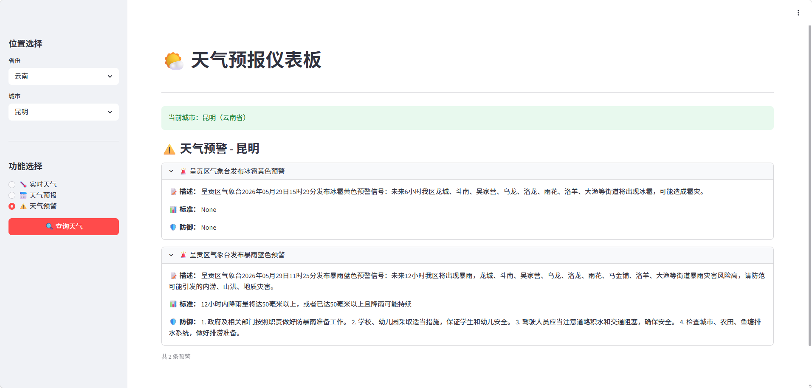

# 🌤天气预报仪表板

基于 Python + Streamlit + 和风天气 API 开发的天气预报查询系统，提供实时天气、多日预报和天气预警功能。

## 项目简介

本项目是一个功能完整的天气预报应用，通过和风天气 API 获取全国各城市的天气数据，并使用 Streamlit 构建美观的 Web 界面进行展示。

### 主要功能

- **实时天气查询** - 温度、湿度、风向、风力、体感温度等
- **15天天气预报** - 最高/最低温度、天气状况、降水量等详细信息
- **天气预警信息** - 实时推送气象灾害预警
- **全国城市覆盖** - 支持中国大陆、港澳台及主要城市
- **交互式界面** - 简洁美观的 Streamlit Web 界面

## 技术栈

- **Python 3.x** - 编程语言
- **Streamlit** - Web 界面框架
- **Pandas** - 数据处理与表格展示
- **Requests** - HTTP 请求库
- **PyJWT** - JWT Token 生成（和风天气 API 认证）
- **python-dotenv** - 环境变量管理
- **和风天气 API** - 气象数据服务

## 📁 项目结构
weather_project/ 
├── ui.py # Streamlit 主界面程序
├── demo.py # API 调用封装模块 
├── GenerateJWT.py # JWT Token 生成模块 
├── .env # 环境变量配置文件（API 密钥） 
├── requirements.txt # Python 依赖包列表 
└── README.md # 项目说明文档

### 文件说明

| 文件名 | 功能描述                                                  |
|--------|-------------------------------------------------------|
| `ui.py` | Streamlit 前端界面，包含城市选择、数据展示、交互逻辑                       |
| `demo.py` | 和风天气 API 调用封装，包括城市查询、实时天气、天气预报、预警信息                   |
| `GenerateJWT.py` | 生成 JWT Token 用于 API 身份认证                              |
| `.env` | 存储和风天气 API 的密钥信息（KEY_ID、PROJECT_ID、PRIVATE_KEY） 需自己创建 |

## 快速开始

### 1. 环境要求

- Python 3.8 或更高版本
- pip 包管理器

### 2. 安装依赖

克隆或下载项目后，在终端执行：

### 3. 配置 API 密钥

项目使用和风天气 API，需要配置认证信息：

1. 注册 [和风天气开发者账号](https://dev.qweather.com/)
2. 创建项目并获取 API 密钥,具体查看官方说明文档（KEY_ID、PROJECT_ID、私钥、APL host）
3. 编辑 `.env` 文件，填入你的配置：

> ⚠️ **注意**：`.env` 文件包含敏感信息，请勿上传到公开仓库！，API_HOST为个人地址，请将demo.py文件中更换成自己的

### 4. 运行应用

在项目根目录执行：streamlit run ui.py

浏览器会自动打开应用界面（默认地址：`http://localhost:8501`）

## 使用说明

### 操作步骤

1. **选择位置**
   - 在左侧边栏选择省份
   - 选择具体城市
   - 点击「查询天气」按钮

2. **切换功能**
   -  **实时天气** - 查看当前温度、湿度、风力等信息
   - **天气预报** - 浏览未来 15 天的天气趋势
   - **天气预警** - 查看气象灾害预警信息

### 界面预览

- **实时天气面板**：展示温度、湿度、风向、体感温度等关键指标
- 
- **天气预报面板**：卡片式展示未来 3 天详细预报，并提供完整数据表格
- 
- **天气预警面板**：展开式显示预警详情（描述、标准、防御措施）

## 🔌 API 接口说明

项目调用的和风天气 API 接口：

| 接口 | 功能 | 参数 |
|------|------|------|
| `/geo/v2/city/lookup` | 城市信息查询 | location: 城市名 |
| `/v7/weather/now` | 实时天气 | location: 城市ID |
| `/v7/weather/15d` | 15天预报 | location: 城市ID |
| `/weatheralert/v1/current/{lat}/{lon}` | 天气预警 | lat: 纬度, lon: 经度 |

## ⚙️ 核心模块详解

### GenerateJWT.py

生成 JWT Token 用于 API 认证：
- 从 `.env` 读取密钥信息
- 使用 EdDSA 算法签名
- Token 有效期约 24 小时

### demo.py

封装 API 调用函数：
- `city_lookup(location)` - 城市名称转 Location ID
- `get_realtime_weather(location_id)` - 获取实时天气
- `get_today_weather(location_id)` - 获取 15 天预报
- `get_weather_warning(latitude, longitude)` - 获取天气预警

### ui.py

Streamlit 界面逻辑：
- 城市选择器（按省份分类）
- 三个功能标签页
- 数据可视化展示

## 注意事项

1. **API 配额限制**：免费版和风天气 API 有调用次数限制，请合理使用
2. **网络要求**：需要联网访问和风天气 API 服务器
3. **时区问题**：API 返回的时间为北京时间（UTC+8）
4. **数据更新频率**：实时天气约每小时更新，预报每日更新

## 常见问题

### Q: 运行时报错 "ModuleNotFoundError"
A: 确保已安装所有依赖：`pip install -r requirements.txt`

### Q: 提示 "请求失败" 或 API 错误
A: 检查 `.env` 中的 API 密钥是否正确，确认网络连接正常

### Q: 找不到某个城市
A: 尝试输入城市全称或使用拼音，部分县级市可能不支持

### Q: Streamlit 端口被占用
A: 指定其他端口运行：`streamlit run ui.py --server.port 8502`

**祝您使用愉快！** 🌈
